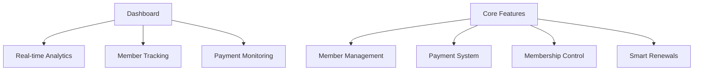

# 🌟 MembershipPro Manager

> Transform your membership management into a seamless experience


## 🚀 What's Inside?

MembershipPro Manager is your all-in-one solution for handling memberships, payments, and user management with style. Built with modern C# and a sleek Windows Forms interface, it's the tool you didn't know you needed until now.

## 📸 System Showcase

🎨 **Modern UI Design**
Show Image
Sleek login interface with modern design principles

🏠 **Interactive Dashboard**
Show Image
Your command center for all membership operations

👥 **Member Management Interface**
Show Image
Efficient member registration and profile management

💫 **Dynamic Membership Control**
Show Image
Complete control over membership lifecycles

💰 **Payment Processing**
Show Image
Streamlined payment tracking and processing

### ✨ Key Features



🎯 **Smart Dashboard**
- Live membership analytics
- Payment status tracking
- Expiration alerts
- Financial insights

🤝 **Member Management**
- Quick member registration
- Profile customization
- Membership history
- Advanced search capabilities

💳 **Payment Processing**
- Multiple payment states
- Automated pending payments
- Transaction history
- Payment analytics

🔄 **Membership Control**
- Custom membership types
- Auto-renewal system
- Status tracking
- Expiration management

## 🛠️ Tech Stack

```csharp
var techStack = new Dictionary<string, string>
{
    {"Framework", ".NET Framework 4.7.2"},
    {"UI", "Windows Forms"},
    {"Database", "SQL Server 2020"},
    {"Architecture", "3-Layer Pattern"},
    {"IDE", "Visual Studio 2019+"}
};
```

## 🚀 Quick Start

### 1. Database Setup
```sql
-- Let's get this party started
CREATE DATABASE MembershipSystem;
USE MembershipSystem;

-- Run migration scripts from /DB
-- (They're properly versioned, don't worry!)
```

### 2. Configuration
```xml
<!-- Update App.config with your magic strings -->
<connectionStrings>
  <add name="MembershipDB" 
       connectionString="Your_Connection_String_Here"
       providerName="System.Data.SqlClient" />
</connectionStrings>
```

### 3. First Launch
```bash
# Default Super Admin Credentials
Username: admin
Password: admin123   # Please change this immediately!
```

## 🗂️ Project Structure

```
🏗️ MembershipPro/
├── 🎮 Controllers/    # Business logic wizardry
├── 📊 Models/         # Data structures
├── 🖼️ Forms/         # UI magic happens here
├── 🗄️ DB/            # SQL sorcery
├── 🎨 Resources/     # Assets & resources
└── 🛠️ Utils/         # Helper tools
```

### Intelligent Payment Tracking
- 🟢 Completed
- 🟡 Pending
- 🔴 Cancelled
- 🔵 Processing

## 🛡️ Security First

- 🔐 User authentication
- 📝 Activity logging
- 🔒 Data encryption
- 💾 Automated backups

## 🚦 Status Codes

| Code | Status | Description |
|------|--------|-------------|
| 🟢 | Active | Membership is active and valid |
| 🟡 | Pending | Awaiting payment confirmation |
| 🔴 | Expired | Membership needs renewal |

## 🤝 Contributing

We love your input! We want to make contributing as easy and transparent as possible, whether it's:

- 🐛 Reporting a bug
- 💡 Suggesting new features
- 🔧 Submitting PRs
- 📚 Improving documentation

## 🆘 Support

Need help? We've got you covered!

- 📧 Email: [Mail Me](mailto:hernandezmjosue23@gmail.com)
- 💬 Discord: [Join our community](https://discord.gg/st69Y3NzA6)

## 📜 License

MIT License - do whatever you want with this! Just remember to star our repo 😉

---

<div align="center">

**Built with ❤️ by [JosueIsOffline](https://github.com/JosueIsOffline), for developers**

</div>
